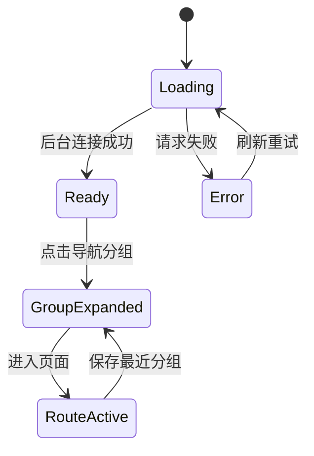

# 后台体验结构化第一轮

> 项目：碎片时间
> 页面/路由：`/admin/*`
> 代码范围：`components/admin/sidebar.tsx`、`app/admin/layout.tsx`
> 状态：第二轮开发中

## 目标与用户旅程
管理员登录后应快速知道系统连接状态、当前所在模块和可执行操作；切换页面后保留最近使用的导航分组，减少重复展开。

## 页面结构与交互状态

## 视觉规范与组件映射
- `AdminLayout` 使用浅色渐变背景、半透明顶栏和连接状态徽标。
- `Sidebar` 使用品牌标识、五组导航、当前路由高亮和 44px 触控高度。
- 颜色与间距遵循 `前端规范与流程.md`。

## a11y与响应式验收
- 分组按钮增加 `aria-expanded`。
- 移动端继续使用抽屉菜单，关闭按钮保持可触达。
- 当前路由同时使用颜色和字重表达，不只依赖颜色。

## 验收清单
- [ ] 桌面端视觉回归
- [ ] 移动端抽屉回归
- [ ] 键盘焦点和折叠状态回归
- [ ] 线上构建、登录和核心页面回读

## 下一步
统一各业务页的工具栏、空态、失败重试和表单反馈；任务页已完成第一批。
